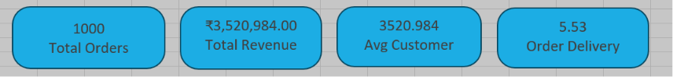
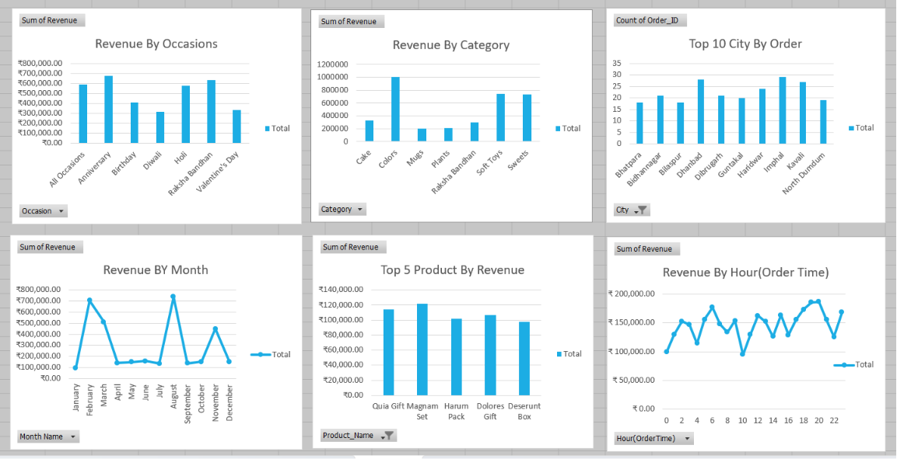
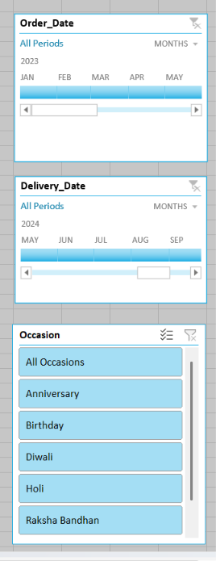

# 📊 Ferns and Petals Sales Analysis Dashboard

## 📌 Overview
This project presents an interactive **Excel dashboard** built using the Ferns and Petals (FNP) sales dataset. The analysis focuses on understanding sales trends, customer behavior, delivery performance, and product popularity across different occasions.

---

## 🎯 Problem Statement
Analyze the FNP dataset to uncover key business insights and help improve sales strategy and customer satisfaction.

---

## 🛠 Tools Used
- Microsoft Excel
- Pivot Tables
- Pivot Charts
- Slicers
- KPI Cards
- Conditional Formatting

---

## 📂 Dataset
The dataset includes:
- Customers Data
- Products Data
- Orders Data
- Delivery Data

---

## 📊 Dashboard Preview

### Main Dashboard


### KPI View


### Charts View


### Filters View


---

## 📈 Key Performance Indicators (KPIs)
- **Total Orders:** 1000
- **Total Revenue:** ₹3,520,984
- **Average Customer Spending:** ₹3520.98
- **Average Delivery Time:** 5.53 Days

---

## 🔍 Business Questions Solved
- What is the total revenue generated?
- What is the average order and delivery time?
- How do monthly sales fluctuate?
- Which products generate the highest revenue?
- What is the average customer spending?
- Which cities place the highest number of orders?
- Which occasions generate maximum revenue?
- Which products are most popular during specific occasions?

---

## 💡 Key Insights
- Anniversary generated the highest revenue.
- Colors category contributed maximum revenue.
- Sales peaked during festive months.
- Top cities contributed the majority of orders.
- Higher order quantity slightly increased delivery time.

---

## 📁 Repository Structure

```bash
FNP-EXCEL/
│
├── dashboard/
│   ├── charts.png
│   ├── filters.png
│   ├── fnp sales.png
│   └── kpis.png
│
├── datasets/
├── docs/
├── excel/
└── README.md
```

---

## 🚀 Project Learnings
Through this project, I improved my skills in:
- Data Cleaning
- Data Analysis
- Dashboard Design
- Business Insight Generation
- Data Visualization using Excel

---

## ✅ Conclusion
This dashboard provides valuable insights into FNP’s business performance and supports better decision-making in inventory planning, customer targeting, and sales strategy.